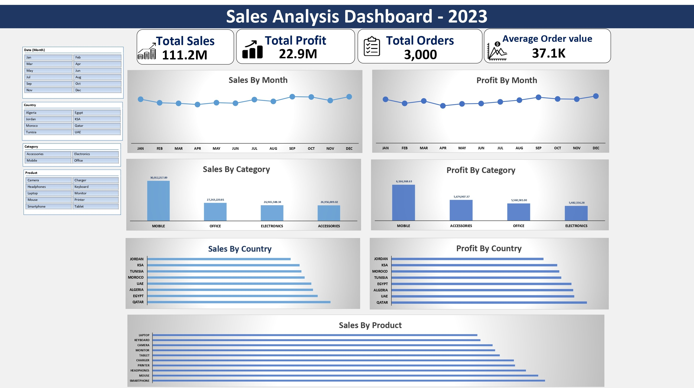

# 📊 Sales Analysis Dashboard

## 📌 Project Overview
This project analyzes sales data using Microsoft Excel, Power Query, and Power Pivot.

The project includes:
- Data Cleaning
- Data Modeling
- Pivot Tables
- Interactive Dashboard
- Business Insights

---

## 🛠 Tools
- Microsoft Excel
- Power Query
- Power Pivot
- Pivot Tables
- Pivot Charts

---

## 🔹 Data Cleaning
- Corrected product names
- Replaced incorrect country names
- Filled missing Total Price values
- Calculated Cost column
- Identified 17 negative sales records (assumed returns)

---

## 🔹 Data Modeling
Relationships were created between the Sales, Customers, and Suppliers tables using Power Pivot.

---

## 📈 Dashboard Features
- Total Sales
- Total Profit
- Total Orders
- Average Order Value
- Sales by Month
- Profit by Month
- Sales by Category
- Profit by Category
- Sales by Country
- Profit by Country
- Sales by Product
- Interactive Slicers
- Timeline Filter

---

## 💡 Business Insights

- 📱 Mobile generated the highest sales among all products.
- 🌍 Qatar achieved the highest total sales among all countries.
- 📈 Sales remained relatively stable throughout the year with a slight increase toward the end of the year.
- 💰 Mobile generated the highest profit among all categories.
- 📦 Office recorded the lowest sales compared to the other categories.

---
## 📷 Dashboard Preview

---

## 📄 Project Report

The complete report is available in **Reports.pdf**.
